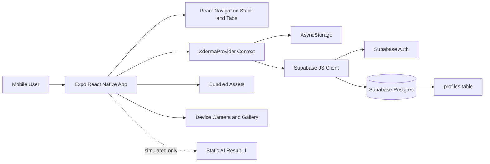
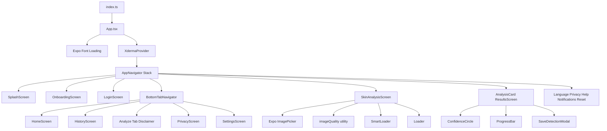
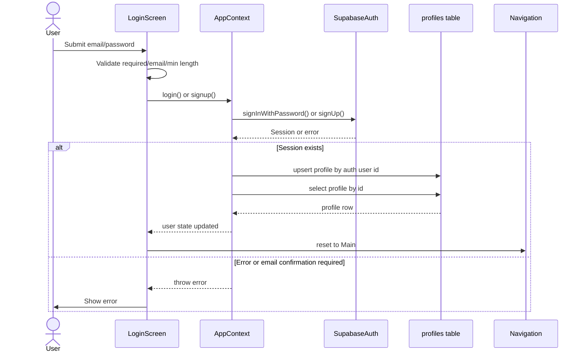
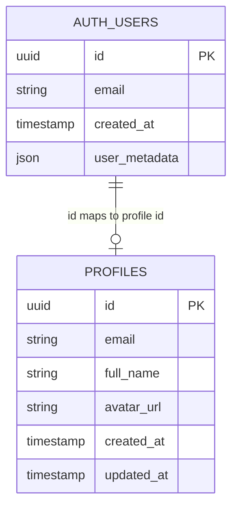
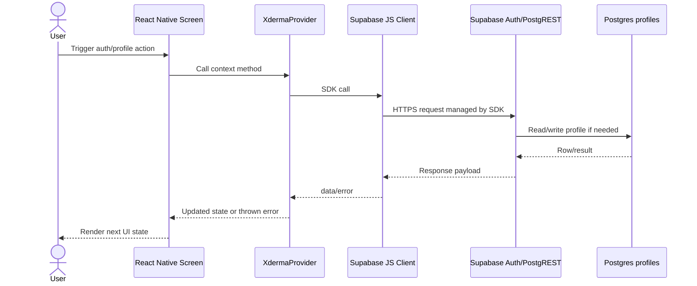
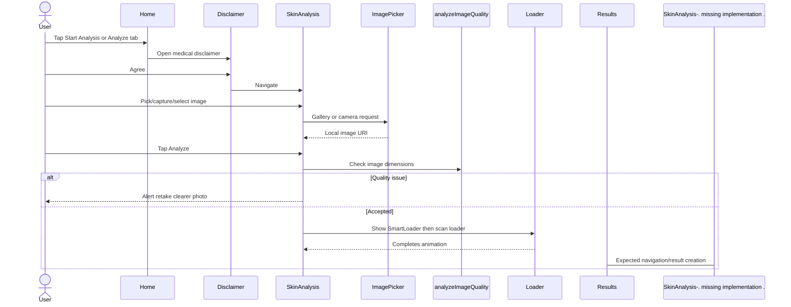

# Xderma Software Architecture Report

Generated from the repository state inspected on 2026-06-18.

## Executive Summary

Xderma is a single-client Expo React Native application. The implemented architecture is a frontend monolith with a layered-by-folder structure: navigation, context/state, screens, utilities, i18n, and static assets. It uses React Navigation for screen orchestration, React Context for app-wide auth/language state, AsyncStorage for local persistence, and Supabase as the only implemented backend integration.

There is no local backend service, API route layer, server-side controller layer, migration folder, model folder, or database schema in the repository. Backend behavior is consumed directly from the mobile app through the Supabase JavaScript client. The only database table referenced by code is `profiles`. The skin analysis, Grad-CAM heatmap, result diagnosis, save-to-history prompt, history screen, privacy settings, notification settings, help content, and much of profile/settings are currently frontend-only or hardcoded UI flows.

The dominant architectural risks are direct Supabase coupling from global context, missing route/auth guards, simulated AI analysis/results, missing persistence for analysis history/settings, incomplete logout wiring, duplicated navigation approaches, hardcoded clinical/model claims, and missing database/API documentation.

## Architecture Classification

| Category | Finding |
| --- | --- |
| Application type | Expo React Native mobile app with optional web target through Expo scripts. |
| Deployment shape | Frontend monolith plus external Backend-as-a-Service. |
| Backend | Supabase Auth, PostgREST database access, and profile persistence consumed directly from the client. |
| Database | Supabase-hosted Postgres is implied; only `profiles` is referenced in code. |
| Architectural pattern | Layered frontend by technical folder, with screen-centric feature implementation. |
| State pattern | React Context for global auth/i18n state, component-local state for feature UI. |
| API pattern | Direct client SDK calls, not repository/service/controller abstraction. |
| Not present | MVC backend, Clean Architecture, microservices, local API server, middleware, migrations, generated database types, formal domain models. |

## System Overview

The runtime starts at `index.ts`, which registers `App.tsx` with Expo. `App.tsx` loads Poppins and Lexend fonts, then wraps the navigation tree in `XdermaProvider`. `AppNavigator` owns the root stack navigator and `BottomTabNavigator` owns the main tab shell.

Supabase integration is centralized at `src/utils/supabase.ts`. Auth state and profile fetching/upserting are implemented in `src/context/AppContext.tsx`. Screens consume the context through `useXderma()` for translation, login, signup, password reset, and language selection.

Skin analysis is implemented as local UI state: users pick or capture an image, the app performs a lightweight dimension-based image quality check, shows animated loaders, and displays hardcoded results in `AnalysisCard`. No network inference request, AI model API call, result insert, image upload, or history persistence is implemented in the current code.

## Project Structure Map

| Path | Purpose |
| --- | --- |
| `App.tsx` | Root React component; loads fonts and provides `XdermaProvider` around navigation. |
| `index.ts` | Expo entry point using `registerRootComponent`. |
| `app.json` | Expo app metadata, splash/icon settings, platform flags. |
| `package.json` | Scripts and dependencies for Expo, React Navigation, Supabase, Reanimated, Moti, image picker, icons, and fonts. |
| `babel.config.js` | Expo Babel preset plus Reanimated plugin. |
| `metro.config.js` | Extends Expo Metro config; adds `cjs`/`mjs` source extensions and resolver main fields. |
| `tsconfig.json` | Extends Expo TS config and enables strict mode. |
| `.env` | Supplies public Supabase environment variables consumed by Expo; values are not documented here. |
| `assets/` | Expo root icons/splash/favicon and duplicate face scan asset. |
| `src/assets/` | UI assets used by screens: logo, backgrounds, onboarding images, sample dermatology images, heatmap, account image. |
| `src/context/AppContext.tsx` | Global auth, profile, language, translations, and helper actions. |
| `src/i18n/translations.ts` | Translation key union, language map, English fallback, and interpolation helper. |
| `src/navigation/AppNavigator.tsx` | Root stack navigator and route registration. |
| `src/navigation/BottomTabNavigator.tsx` | Main bottom-tab shell with Home, History, Analyze trigger, Privacy, Settings. |
| `src/screens/` | Screen components, screen-local UI components, modals, loaders, and chart-like widgets. |
| `src/utils/supabase.ts` | Supabase client factory using AsyncStorage-backed auth persistence. |
| `src/utils/imageQuality.ts` | Lightweight image quality utility based on image dimensions. |
| `src/types/react-native-canvas.d.ts` | Ambient module declaration for `react-native-canvas`; no active imports found. |
| `docs/architecture-report.md` | This architecture report. |

## Major Modules and Responsibilities

| Module | Responsibility | Important Dependencies |
| --- | --- | --- |
| App shell | Starts app, loads fonts, wraps providers. | Expo fonts, `XdermaProvider`, `AppNavigator`. |
| Navigation | Defines stack and tab routes, headers, analysis disclaimer gating. | React Navigation stack/tabs, screens, `useXderma` translation. |
| App context | Loads/persists language, manages Supabase auth session, profile reads/upserts, exposes auth methods. | AsyncStorage, Supabase Auth, Supabase `profiles`, translations. |
| Authentication UI | Login/signup form validation, password reset request, navigation after auth. | `useXderma`, Supabase via context. |
| Onboarding/splash | Initial branded flow before login. | Local assets and navigation. |
| Home | Dashboard/landing screen, stats, analysis entry point, disclaimer modal. | Local UI state, `DisclaimerModal`, translations. |
| Skin analysis | Image selection/camera, symptom notes, local image quality check, animated analysis phases. | Expo ImagePicker, `analyzeImageQuality`, `SmartLoader`, `Loader`. |
| Results | Displays static model metadata, static diagnosis/confidence/differentials, optional symptoms, Grad-CAM overlay. | Local assets, `ConfidenceCircle`, `ProgressBar`, `SaveDetectionModal`. |
| History | Displays hardcoded sample scan history and filter chips. | Local sample assets, FlatList. |
| Settings/profile | Displays static account image/email, menu navigation, nested settings page. | React Navigation, context translation; logout UI not wired. |
| Privacy | Local toggles for data usage, permissions, security, danger actions. | Component-local state only. |
| Notifications | Local toggles grouped by category. | Component-local state only. |
| Language | Persists selected language in context/AsyncStorage. | `setLanguage`, translations. |
| Help center | Static categories, search input UI, FAQ accordion. | Local state only. |
| Modals/loaders/widgets | Reusable UI primitives for disclaimer, save prompt, loaders, confidence/progress display. | Moti/Reanimated, BlurView, SVG. |

## File-Level Code References

| Concern | Evidence |
| --- | --- |
| App wrapper | `App.tsx:21` defines the root app; `App.tsx:42` wraps navigation in `XdermaProvider`. |
| Stack routes | `src/navigation/AppNavigator.tsx:28` starts `NavigationContainer`; `src/navigation/AppNavigator.tsx:30` through `src/navigation/AppNavigator.tsx:99` register stack screens. |
| Bottom tabs | `src/navigation/BottomTabNavigator.tsx:93` through `src/navigation/BottomTabNavigator.tsx:121` define tabs; `src/navigation/BottomTabNavigator.tsx:95` uses an `Analyze` tab as a modal trigger. |
| Supabase client | `src/utils/supabase.ts:4` creates the client; `src/utils/supabase.ts:9` uses AsyncStorage-backed auth persistence. |
| Profile read | `src/context/AppContext.tsx:49` builds a user from session; `src/context/AppContext.tsx:53` selects from `profiles`. |
| Profile upsert | `src/context/AppContext.tsx:71` defines profile upsert; `src/context/AppContext.tsx:74` writes to `profiles`. |
| Auth load/listener | `src/context/AppContext.tsx:115` loads session; `src/context/AppContext.tsx:146` subscribes to auth state changes. |
| Login/signup/reset | `src/context/AppContext.tsx:178`, `src/context/AppContext.tsx:201`, and `src/context/AppContext.tsx:229`. |
| Language persistence | `src/context/AppContext.tsx:44` defines `xderma_language`; `src/context/AppContext.tsx:98` loads it; `src/context/AppContext.tsx:171` saves it. |
| Translation fallback | `src/i18n/translations.ts:194` defines translations; `src/i18n/translations.ts:873` resolves translated strings with English fallback. |
| Image picking | `src/screens/SkinAnalysisScreen.tsx:67` opens gallery; `src/screens/SkinAnalysisScreen.tsx:78` opens camera. |
| Analysis trigger | `src/screens/SkinAnalysisScreen.tsx:84` handles analysis; `src/screens/SkinAnalysisScreen.tsx:88` calls local image quality check. |
| Image quality | `src/utils/imageQuality.ts:12` analyzes image size and marks very small images as blurry. |
| Results content | `src/screens/AnalysisCard.tsx:70` displays selected image/fallback; diagnosis/model details are static in the same component. |
| Save prompt | `src/screens/AnalysisCard.tsx:201` renders `SaveDetectionModal`; the modal callbacks only continue navigation. |
| History data | `src/screens/HistoryScreen.tsx:27` defines hardcoded history items. |
| Settings logout UI | `src/screens/SettingsScreen.tsx:154` renders logout button without calling context `logout`. |

## Data Flow Overview

### Implemented Auth/Profile Flow

1. User enters email/password in `LoginScreen`.
2. `LoginScreen` validates basic email/password rules locally.
3. `LoginScreen` calls `login()` or `signup()` from `useXderma`.
4. `AppContext` calls Supabase Auth through `signInWithPassword()` or `signUp()`.
5. On session success, `AppContext` upserts a row in `profiles`.
6. `AppContext` reads `profiles` by `authUser.id` and maps it to the local `User` shape.
7. Context updates `user`, `isLoggedIn`, and `authLoading`.
8. `LoginScreen` resets navigation to `Main`.

### Implemented Language Flow

1. `AppContext` loads `xderma_language` from AsyncStorage on mount.
2. `LanguageScreen` calls `setLanguage(id)`.
3. `AppContext` updates context state and writes the selected language to AsyncStorage.
4. Screens using `t()` render translated text where translation keys are implemented.

### Implemented Skin Analysis UI Flow

1. User enters Home or taps Analyze tab.
2. `DisclaimerModal` is shown before navigating to `SkinAnalysis`.
3. User picks gallery image, opens camera, or selects a sample image.
4. `SkinAnalysisScreen` stores image URI and symptoms in component state.
5. `handleAnalyze()` calls `analyzeImageQuality()`.
6. If the image is very small, the app alerts a quality issue.
7. Otherwise, `SmartLoader` shows for about three seconds.
8. `Loader` shows a scan animation for about four seconds.
9. Current implementation does not navigate to `ResultsScreen` after the loader, despite `ResultsScreen` being registered.

### Intended But Not Implemented End-to-End

| Flow | Current state |
| --- | --- |
| Frontend to AI backend | No `fetch`, Supabase function call, model endpoint, or inference service call found. |
| AI backend to database | No implementation found. |
| Result persistence | Save modal does not insert/update any table. |
| History retrieval | History screen uses static local array. |
| Image storage | No Supabase Storage upload call found. |
| Privacy/notification settings persistence | Toggles are component-local only. |
| Authorization guards | Routes are registered globally; no guard blocks unauthenticated access to main screens. |

## API Flow Overview

The app does not define REST/GraphQL API routes. All backend access is through Supabase client APIs:

| API surface | Caller | Backend capability |
| --- | --- | --- |
| `supabase.auth.getSession()` | `AppContext` mount | Reads persisted auth session. |
| `supabase.auth.onAuthStateChange()` | `AppContext` mount | Subscribes to auth changes. |
| `supabase.auth.signInWithPassword()` | `login()` | Email/password login. |
| `supabase.auth.signUp()` | `signup()` | Email/password signup. |
| `supabase.auth.signOut()` | `logout()` | Ends auth session. |
| `supabase.auth.resetPasswordForEmail()` | `resetPassword()` | Sends Supabase password recovery email. |
| `supabase.from('profiles').select().eq().maybeSingle()` | `createUserFromSession()` | Reads profile row. |
| `supabase.from('profiles').upsert()` | `upsertProfile()` | Creates/updates profile row. |

## Database Relationships Overview

Only one application table is referenced in the codebase:

| Entity | Fields referenced | Relationship inferred from code |
| --- | --- | --- |
| Supabase Auth `users` | `id`, `email`, `created_at`, `user_metadata.full_name`, `user_metadata.avatar_url` | Source of authenticated identity. |
| `profiles` | `id`, `email`, `avatar_url`, `created_at`, `full_name`, `updated_at` | `profiles.id` is expected to match Supabase Auth user id. |

Assumption: `profiles.id` is likely a primary key and foreign key to `auth.users.id`, because the client upserts with `onConflict: 'id'` and queries by authenticated user id. The repository does not include migrations, RLS policies, SQL schema, or generated Supabase types to verify this.

No tables are implemented for analyses, images, history, privacy settings, notification settings, or audit/disclaimer consent.

## State Management Overview

| State scope | Implementation |
| --- | --- |
| Global auth user | React Context in `AppContext`. |
| Global auth loading | React Context in `AppContext`. |
| Global language | React Context plus AsyncStorage persistence. |
| Search query | Context setter exists, but stored value is not exposed or used. |
| Navigation state | React Navigation stack and tab navigators. |
| Login form state | `LoginScreen` component-local state. |
| Password reset state | `PasswordResetScreen` component-local state. |
| Skin image/symptoms/loader state | `SkinAnalysisScreen` component-local state. |
| Result save modal state | `AnalysisCard` component-local state. |
| Privacy/notification toggles | Component-local state only. |
| History | Hardcoded local array, not stateful persistence. |

## Mermaid Diagrams

### High-Level System Architecture

### Application Component Architecture

### Authentication Flow

### Database Entity Relationships

### Request/Response Flow

### Skin Analysis UI Flow

## Architectural Issues and Risks

| Severity | Issue | Evidence | Recommendation |
| --- | --- | --- | --- |
| High | AI analysis is simulated and does not produce actual model/API output. | `SkinAnalysisScreen` only calls `analyzeImageQuality`; `AnalysisCard` contains static diagnosis/model text. | Add a real inference service contract, result DTOs, API error states, and tests around request/response handling. |
| High | History/save flow is not persisted. | `SaveDetectionModal` has no database write; `HistoryScreen` uses local sample `data`. | Create `analyses` table, result service, save/read flows, and RLS policies scoped to user id. |
| High | Routes are not auth-guarded. | Stack registers `Main`, `Home`, `SkinAnalysis`, `History`, etc. without checking `isLoggedIn`. | Add an auth-aware navigator that routes unauthenticated users to onboarding/login and authenticated users to main app. |
| High | Medical claims and result content are hardcoded. | Home stats and `AnalysisCard` model/diagnosis text are fixed. | Mark prototype content clearly or load model metadata/results from trusted backend responses. |
| Medium | Supabase data access is coupled directly into context. | `AppContext` handles auth, profile queries, language, translation, and search setter. | Split into `authService`, `profileService`, `useAuth`, and `LanguageProvider` or similar modules. |
| Medium | Logout button is not wired. | Settings logout UI does not call `logout()`. | Connect settings logout to context and reset navigation to login/onboarding. |
| Medium | Password reset UI asks for a 6-digit code, but context only sends Supabase password recovery email. | `PasswordResetScreen` shows code-entry state after `resetPasswordForEmail()`. | Align UI with Supabase recovery link/OTP mode actually configured, then implement verification/update password. |
| Medium | Privacy/notification settings are local-only. | Toggles use component-local state and reset on unmount. | Persist locally or in Supabase user settings, depending on product requirement. |
| Medium | Database schema and RLS policies are missing from repo. | No migration/schema files found; only `profiles` is referenced. | Add Supabase migrations, generated DB types, and documented RLS rules. |
| Medium | Duplicate navigation patterns exist. | `BottomTabNavigator` and `MainScreen` both represent main app shells, but stack uses bottom tabs as `Main`. | Remove unused `MainScreen` or converge shells to one navigation model. |
| Medium | i18n coverage is inconsistent. | Some screens use `t()`, while onboarding/help/history/privacy/results include hardcoded English. | Move user-visible strings to translation keys or declare only selected screens localized. |
| Medium | Encoding corruption appears in several comments/strings/translations. | Examples include mojibake in comments and non-English translations. | Normalize file encoding to UTF-8 and validate translations. |
| Low | `setSearchQuery` exists but query value is unused. | Context stores setter-only search state. | Remove until needed or expose and implement search. |
| Low | Imported dependencies/types are unused or vestigial. | `react-native-canvas` declaration exists without active usage; some icons/imports are unused. | Prune dead code during cleanup. |
| Low | README is still Expo Snack boilerplate. | `README.md` describes generic Snack app. | Replace with product setup, env, architecture, and run instructions. |

## Security and Compliance Considerations

| Area | Current implementation | Risk |
| --- | --- | --- |
| Auth session storage | Supabase session persists in AsyncStorage. | Standard for React Native Supabase, but threat model should account for device compromise. |
| Supabase key | Uses `EXPO_PUBLIC_SUPABASE_KEY`. | Public anon keys are expected in clients, but RLS must be strict because clients can call Supabase directly. |
| RLS | Not documented in repo. | Cannot verify whether `profiles` access is restricted per user. |
| Medical disclaimer | Present before analysis entry. | Disclaimer acceptance is not persisted/audited. |
| Image privacy | UI says images are not permanently stored. | Current implementation does not upload images, so claim holds for current code; future backend integration must preserve or update this promise. |
| Password reset | Sends reset request but code UI is not verified. | Users may believe a code flow exists when it is not implemented. |
| Delete account/history | UI exists but actions are not implemented. | User trust and compliance risk if presented as functional. |

## Missing Documentation

The following areas are unclear or undocumented in the repository:

1. Supabase project setup, environment variable names, redirect URLs, auth provider configuration.
2. Database schema, migrations, table relationships, indexes, and generated TypeScript database types.
3. Row Level Security policies for `profiles` and any future analysis/history tables.
4. AI model architecture, serving location, input format, output schema, confidence calibration, Grad-CAM generation, and clinical validation.
5. Image handling policy: local-only, temporary upload, permanent storage, deletion, retention, consent.
6. Authentication lifecycle: onboarding rules, route guarding, session restore behavior, password recovery completion.
7. Privacy and notification settings persistence model.
8. Testing strategy and release/build/deployment instructions.
9. Which screen strings are intended to be localized and which are prototype-only.
10. Accessibility and clinical safety review process.

## Assumptions

These assumptions are necessary because implementation details are absent:

1. `profiles.id` is intended to match Supabase Auth `users.id`.
2. Supabase Postgres is the database, because `@supabase/supabase-js` is used and `profiles` is queried through PostgREST.
3. Current AI analysis is a prototype/simulation, because no inference API/model call is implemented.
4. `ResultsScreen` is intended to show after analysis, but current loader flow does not navigate there.
5. History is intended to become user-specific persisted data, because the UI includes save/history language but no table exists.

## Recommended Future Architecture Roadmap

### Phase 1: Stabilize Current App

1. Add an auth-aware navigator and session bootstrap screen.
2. Wire logout, password reset completion, and route resets.
3. Remove unused `MainScreen` or make it the single main shell.
4. Replace README boilerplate with setup, env, and run instructions.
5. Normalize UTF-8 strings and fix corrupted translations/comments.

### Phase 2: Introduce Data Boundaries

1. Create `src/services/authService.ts`, `profileService.ts`, and `analysisService.ts`.
2. Move Supabase table calls out of context and screens.
3. Add typed DTOs for profile, analysis request, analysis result, and history item.
4. Generate Supabase database types and use them in service methods.
5. Add explicit loading/error/result states for all async flows.

### Phase 3: Persist Product Data

1. Add migrations for `profiles`, `analyses`, optional `analysis_images`, `user_settings`, and `disclaimer_consents`.
2. Implement RLS policies so users can only access their own rows.
3. Implement save-to-history and history retrieval.
4. Decide and document image storage/retention behavior.
5. Persist privacy and notification preferences.

### Phase 4: Real AI Integration

1. Define inference API contract and schema.
2. Add a backend endpoint or Supabase Edge Function that receives image references and symptoms.
3. Run model inference server-side, not in the mobile client.
4. Return condition probabilities, calibrated confidence, risk category, explanation, and optional heatmap URL.
5. Store result metadata separately from any sensitive image storage.

### Phase 5: Clinical, Security, and Quality Hardening

1. Add tests for auth flows, analysis service, history persistence, and navigation guards.
2. Add clinical disclaimer consent tracking.
3. Add audit logging for analysis creation/deletion if required.
4. Add monitoring for inference failures and Supabase API errors.
5. Review all medical language and model metrics for evidence-backed accuracy.

